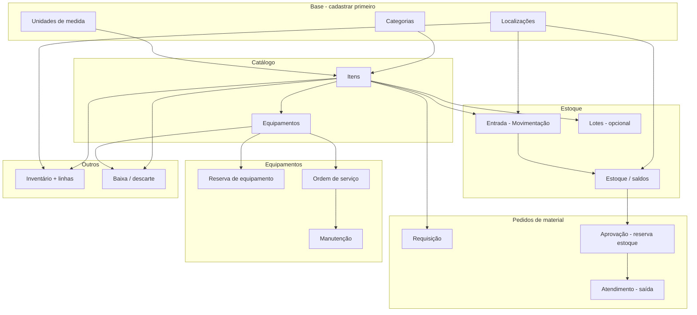

# Guia de uso e apresentação ao cliente — LabManager

Este documento explica **como usar o sistema na prática**, na ordem ideal para **demonstrar ao cliente**, incluindo **o que precisa existir antes** de cada tela funcionar (dependências entre cadastros).

---

## 1. Visão geral

O **LabManager** controla, em um único lugar:

- **Catálogo** — o que o laboratório possui (itens, equipamentos, categorias)
- **Onde está** — localizações (prédio, lab, armário)
- **Quanto tem** — estoque, lotes, movimentações
- **Quem pediu o quê** — requisições internas com **reserva de material** na aprovação
- **Agenda de equipamentos** — reservas de horário com confirmação do gestor
- **Manutenção** — ordens de serviço e registros de manutenção
- **Conformidade** — inventários físicos, baixas/descartes, trilha de auditoria
- **Pessoas e perfis** — usuários, permissões e solicitação de troca de perfil

### Onde o usuário trabalha

| Ambiente | URL | Uso |
|----------|-----|-----|
| Site público | `/` | Apresentação; login e cadastro |
| Painel operacional | `/app/` | **Dia a dia do laboratório** (este guia foca aqui) |
| Admin Django | `/admin/` | Suporte técnico (opcional na demo) |
| API REST | `/api/v1/` | Integrações / app futuro (mencionar, não obrigatório na demo) |

### Fluxo de entrada

1. Acesse `http://127.0.0.1:8000/` (ou URL do servidor).
2. **Cadastrar** → cria conta com perfil **Solicitante** (automático).
3. **Login** → redireciona para `/app/` (dashboard).
4. Menu lateral muda conforme o **perfil** do usuário.

---

## 2. Perfis e menu lateral

Cada perfil vê apenas o que pode fazer. Na apresentação, use **três contas** (ou troque perfil via gestão de usuários):

| Perfil | Papel na demo | Itens principais do menu |
|--------|----------------|---------------------------|
| **Solicitante** | Pesquisador / aluno | Início, Catálogo (leitura), Requisições, Reservas, Meu perfil |
| **Almoxarife** | Estoque físico | Tudo do solicitante + Localizações, Unidades, Lotes, Estoque, Movimentações, Inventários, Baixas |
| **Gestor** | Coordenador do lab | Quase tudo + aprovar requisições/reservas, Usuários, Solicitações de perfil, Auditoria, OS |
| **Admin** | TI / responsável máximo | Igual gestor + pode promover outros a **admin** |
| **Técnico de manutenção** | Manutenção | OS, Manutenções, Catálogo (leitura) |
| **Técnico de lab** | Similar solicitante | Requisições, Reservas, consultas |
| **Auditor / Fiscal** | Conformidade | Consulta + Auditoria |

**Superusuário Django** (`is_superuser`): vê tudo, ignora restrições de perfil.

---

## 3. Mapa de dependências (o que depende do quê)

Antes de mostrar uma tela, garanta que os cadastros “pais” existem.



### Regra de ouro para a demo

| Ordem | O que cadastrar | Quem faz (sugestão) |
|-------|-----------------|---------------------|
| 1 | Categorias, Unidades, Localizações | Almoxarife ou Gestor |
| 2 | Itens (consumível, reagente, etc.) | Almoxarife |
| 3 | Entrada de estoque (movimentação) | Almoxarife |
| 4 | (Opcional) Lotes com validade | Almoxarife |
| 5 | Item tipo equipamento + Equipamento | Almoxarife |
| 6 | Requisição → aprovação → atendimento | Solicitante → Gestor → Almoxarife |
| 7 | Reserva de equipamento | Solicitante → Gestor |
| 8 | Ordem de serviço → manutenção | Técnico manutenção / Gestor |
| 9 | Inventário / Baixa | Almoxarife / Gestor |

**Sem estoque (entrada),** requisição aprovada **falha** na reserva por falta de saldo livre.

**Sem equipamento cadastrado,** a tela **Reservas** não tem o que selecionar.

---

## 4. Roteiro de apresentação ao cliente (45–60 min)

Sugestão de narrativa em **7 blocos**, do mais simples ao mais completo.

### Bloco A — Primeiro contato (5 min)

1. Mostrar landing `/` — proposta do produto.
2. **Cadastro** de um usuário demo (vira **Solicitante**).
3. Explicar: “Quem entra novo pede material; o coordenador promove quem trabalha no almoxarife.”
4. Login → **Dashboard** `/app/` — cards: itens ativos, requisições abertas, alertas de estoque, OS abertas.

### Bloco B — Montar o laboratório no sistema (10 min)

Login como **Almoxarife** ou **Gestor** (conta preparada antes).

| Passo | Tela | URL | O que mostrar |
|-------|------|-----|----------------|
| B1 | Categorias | `/app/categorias/` | Ex.: “Reagentes”, “Consumíveis” |
| B2 | Unidades | `/app/unidades-medida/` | Ex.: Litro (L), Unidade (un) |
| B3 | Localizações | `/app/localizacoes/` | Ex.: “Lab Bioquímica”, tipo Laboratório |
| B4 | Itens | `/app/itens/novo/` | Reagente A, código, categoria, unidade |
| B5 | Movimentação entrada | `/app/movimentacoes/nova/` | Tipo **Entrada**, item, qtd, **destino** = Lab |
| B6 | Estoque | `/app/estoques/` | Colunas Total, Reservado, **Livre** |

**Frase para o cliente:** “Primeiro cadastramos o que existe e onde fica; depois registramos a entrada física; o sistema passa a saber o saldo.”

### Bloco C — Requisição com reserva (12 min)

Três papéis (três navegadores ou troca de login).

| Passo | Quem | Tela | Ação |
|-------|------|------|------|
| C1 | Solicitante | `/app/requisicoes/nova/` | Finalidade + justificativa |
| C2 | Solicitante | Detalhe da requisição | Adicionar item + quantidade |
| C3 | Gestor | Mesma requisição | **Aprovar e reservar estoque** — sistema escolhe local com saldo |
| C4 | Todos | Detalhe | Coluna **Reserva** mostra o armário/lab bloqueado |
| C5 | Almoxarife | `/app/estoques/` | Saldo **Reservado** aumentou; **Livre** diminuiu |
| C6 | Almoxarife | Detalhe | **Atender** na localização reservada — baixa física |
| C7 | Todos | Requisição | Status **Atendida** |

**Frase:** “Aprovar não é só papelada: o material já fica separado logicamente até o almoxarife entregar.”

### Bloco D — Reserva de equipamento (8 min)

| Passo | Quem | Tela | Pré-requisito |
|-------|------|------|----------------|
| D1 | Almoxarife | `/app/equipamentos/novo/` | Item com tipo **equipamento** |
| D2 | Solicitante | `/app/reservas-equipamento/nova/` | Equipamento existente |
| D3 | Solicitante | Lista reservas | Status **Pendente** |
| D4 | Gestor | Lista | **Confirmar** |
| D5 | Gestor | Nova reserva sobreposta | Mostrar **erro de conflito** de horário (valor de negócio) |

### Bloco E — Manutenção (7 min)

| Passo | Tela | Pré-requisito |
|-------|------|----------------|
| E1 | `/app/ordens-servico/nova/` | Equipamento |
| E2 | Lista OS | **Iniciar** → **Encerrar** |
| E3 | Detalhe OS `#id` | **Registrar manutenção** (preventiva/corretiva) |
| E4 | `/app/manutencoes/` | Lista global |

### Bloco F — Governança (8 min)

| Tela | Público | Mensagem |
|------|---------|----------|
| `/app/inventarios/` | Almoxarife | Contagem física vs sistema |
| `/app/baixas/` | Gestor/Almoxarife | Descarte / baixa com motivo |
| `/app/auditoria/` | Gestor | Quem fez o quê |
| `/app/usuarios/` | Gestor | Alterar perfil (ex.: solicitante → almoxarife) |
| `/app/meu-perfil/solicitacao/` | Solicitante | Pedir troca de perfil |
| `/app/solicitacoes-perfil/` | Gestor | Aprovar pedido de perfil |

### Bloco G — Encerramento (5 min)

- Recapitular: um fluxo, um painel, rastreabilidade.
- Mencionar API e possível app mobile/Next.js no futuro.
- Perguntas.

---

## 5. Telas do painel — referência completa

### 5.1 Início (Dashboard)

- **URL:** `/app/`
- **Quem vê:** todos logados
- **Dependências:** nenhuma (lê dados já existentes)
- **O que mostra:** totais e alertas resumidos
- **Uso na demo:** ponto de partida após login

---

### 5.2 Catálogo

#### Categorias — `/app/categorias/`

| | |
|--|--|
| **Depende de** | nada |
| **Necessário para** | classificar **Itens** |
| **Quem cadastra** | Almoxarife, Gestor, Admin |
| **Ações** | Nova, Editar, Excluir |

#### Unidades de medida — `/app/unidades-medida/`

| | |
|--|--|
| **Depende de** | nada |
| **Necessário para** | **Itens** (litro, unidade, etc.) |
| **Quem cadastra** | Almoxarife+ |

#### Itens — `/app/itens/`

| | |
|--|--|
| **Depende de** | Categoria e Unidade (recomendado) |
| **Necessário para** | Estoque, Requisições, Lotes, Inventário, Baixa (item) |
| **Tipos** | equipamento, consumível, reagente, EPI, peça |
| **Equipamento** | só itens tipo **equipamento** viram registro em Equipamentos |
| **Filtro** | por tipo na lista |

#### Equipamentos — `/app/equipamentos/`

| | |
|--|--|
| **Depende de** | **Item** já criado com `tipo_item = equipamento` |
| **Necessário para** | **Reservas de equipamento**, **Ordens de serviço**, Baixa (equipamento) |
| **Campos chave** | número de série, tombamento, status operacional |

**Fluxo correto para chegar em Reservas:**

1. Criar **Item** “Microscópio” (tipo equipamento).
2. Criar **Equipamento** vinculado a esse item.
3. Ir em **Reservas** → Nova reserva → escolher equipamento.

---

### 5.3 Localização e estoque

#### Localizações — `/app/localizacoes/`

| | |
|--|--|
| **Depende de** | nada (pode ter “pai”: campus → prédio → lab) |
| **Necessário para** | Movimentações, Estoque, atendimento de requisição, inventário |
| **Tipos** | campus, prédio, laboratório, armário, posição |

#### Estoque — `/app/estoques/`

| | |
|--|--|
| **Depende de** | pelo menos uma **Entrada** (movimentação) item + local |
| **Somente leitura** | não cria saldo aqui; só consulta |
| **Colunas** | Total, Reservado, **Livre**, alerta |
| **Ação** | **Níveis** — editar mínimo e nível de alerta |

#### Movimentações — `/app/movimentacoes/` e `/nova/`

| Tipo | Origem | Destino | Efeito |
|------|--------|---------|--------|
| **Entrada** | — | obrigatório | Aumenta saldo (cria estoque se não existir) |
| **Saída** | obrigatório | — | Diminui saldo (valida saldo **livre**) |
| **Transferência** | obrigatório | obrigatório | Move entre locais |
| **Ajuste** | — | obrigatório | Define saldo absoluto no local |

**Histórico:** `/app/movimentacoes/` (lista).

#### Lotes — `/app/lotes/`

| | |
|--|--|
| **Depende de** | **Item** |
| **Opcional** | controle de validade (FEFO na API) |
| **Uso** | reagentes com validade; atendimento pode informar lote |

---

### 5.4 Requisições (material)

#### Lista — `/app/requisicoes/`

- Solicitante vê **só as suas**; gestão/almoxarife vê todas.

#### Nova — `/app/requisicoes/nova/`

| | |
|--|--|
| **Depende de** | usuário com perfil de solicitação |
| **Depois** | adicionar itens no detalhe |

#### Detalhe — `/app/requisicoes/<id>/`

| Status | O que acontece |
|--------|----------------|
| Aberta / Em aprovação | Gestor pode **Aprovar e reservar** ou **Rejeitar** |
| Aprovada | Almoxarife **Atende** cada linha (local reservado sugerido) |
| Atendida / Rejeitada | fluxo encerrado |

**Dependências para aprovação com sucesso:**

- Itens na requisição
- **Saldo livre** ≥ quantidade aprovada em alguma localização

**Dependências para atender:**

- Requisição **Aprovada**
- Localização com reserva (ou compatível)

---

### 5.5 Reservas de equipamento

#### Lista — `/app/reservas-equipamento/`

| | |
|--|--|
| **Depende de** | **Equipamento** cadastrado |
| **Quem cria** | Solicitante, Técnico lab, Almoxarife, etc. |
| **Quem confirma** | Gestor, Admin |

#### Nova — `/app/reservas-equipamento/nova/`

| Campo | Regra |
|-------|--------|
| Equipamento | obrigatório (lista vem de Equipamentos) |
| Início / Fim | fim > início |
| Finalidade | texto obrigatório |

**Status:** Pendente → **Confirmada** (gestor) ou **Cancelada** / **Encerrada**

**Conflito:** duas reservas pendentes/confirmadas no mesmo horário para o mesmo equipamento são bloqueadas.

---

### 5.6 Ordens de serviço e manutenção

#### OS — `/app/ordens-servico/`

| | |
|--|--|
| **Depende de** | **Equipamento** |
| **Fluxo** | Nova OS → **Iniciar** → **Encerrar** |
| **Quem** | Gestor, Técnico manutenção |

#### Detalhe OS — `/app/ordens-servico/<id>/`

- Lista manutenções da OS
- Botão **Registrar manutenção**

#### Manutenções — `/app/manutencoes/`

- Visão global; pode criar manutenção ligada a uma OS
- Tipos: preventiva, corretiva, calibração, etc.

---

### 5.7 Inventário

#### Lista — `/app/inventarios/`

| | |
|--|--|
| **Quem cria** | Almoxarife+ |
| **Após criar** | abre **detalhe** para linhas de contagem |

#### Detalhe — `/app/inventarios/<id>/`

| | |
|--|--|
| **Depende de** | inventário criado |
| **Linhas** | Item + local + qtd sistema vs qtd contada → **diferença** automática |

---

### 5.8 Baixas e descarte

#### `/app/baixas/`

| | |
|--|--|
| **Depende de** | **Item** ou **Equipamento** (pelo menos um) |
| **Quem** | Gestor, Almoxarife |
| **Tipos** | descarte, baixa, perda, obsolescência, avaria |

---

### 5.9 Auditoria

#### `/app/auditoria/`

| | |
|--|--|
| **Somente leitura** | registros automáticos de ações |
| **Quem vê** | Gestor, Admin, Auditor, Fiscal |
| **Uso** | “Quem aprovou esta requisição?” |

---

### 5.10 Usuários e perfis

#### Usuários — `/app/usuarios/`

| | |
|--|--|
| **Quem** | Gestor, Admin |
| **Ação** | Editar nome, perfil, ativo |
| **Regra** | só **Admin** promove outro usuário a **admin** |

#### Meu perfil — `/app/meu-perfil/solicitacao/`

| | |
|--|--|
| **Qualquer logado** | pede mudança para almoxarife, gestor, etc. |
| **Uma pendente** | por vez |

#### Solicitações de perfil — `/app/solicitacoes-perfil/`

| | |
|--|--|
| **Gestor/Admin** | aprova ou rejeita pedidos |

---

## 6. Cenário único “do zero” para ensaio da demo

Prepare **antes** da reunião (30 min):

```bash
# Ambiente
uv sync   # ou pip install -e .
# .env com SECRET_KEY, DEBUG, DATABASE_URL
docker compose up -d   # se usar Postgres local
uv run python manage.py migrate
uv run python manage.py bootstrap_admin \
  --email admin@lab.test --nome Admin --password 'SenhaSegura123!'
```

Criar no `/admin/` ou via `/app/usuarios/` (como admin):

| E-mail | Perfil | Uso na demo |
|--------|--------|-------------|
| admin@lab.test | admin | preparação |
| gestor@lab.test | gestor | aprovações |
| almox@lab.test | almoxarife | estoque |
| aluno@lab.test | solicitante | pedidos |

**Script de dados mínimos (almoxarife):**

1. Categoria `REAG` — Reagentes  
2. Unidade `mL`  
3. Localização `Lab Central`  
4. Item `REAG-001` — Etanol, tipo reagente  
5. Movimentação entrada: 100 mL → Lab Central  
6. Item `EQ-001` — Microscópio, tipo equipamento  
7. Equipamento série `MIC-001`  
8. (Opcional) Lote para REAG-001  

**Script de demonstração (ao vivo):**

1. Login **aluno** → requisição 10 mL → gestor aprova → almox atende  
2. Login **aluno** → reserva microscópio amanhã 14h–16h → gestor confirma  
3. Login **gestor** → auditoria → mostrar rastros  

---

## 7. Mensagens de erro comuns (para responder ao cliente)

| Mensagem | Causa | O que fazer na demo |
|----------|--------|---------------------|
| Saldo livre insuficiente | Sem entrada ou tudo reservado | Fazer entrada antes ou liberar requisição rejeitada |
| Sem permissão para esta página | Perfil errado | Trocar usuário ou solicitar perfil |
| Conflito de horário (reserva) | Equipamento já reservado | Escolher outro horário ou equipamento |
| Você já possui solicitação pendente (perfil) | Troca de perfil duplicada | Aguardar análise ou cancelar |
| Não é possível excluir: registros vinculados | Item usado em estoque/OS | Desativar em vez de excluir |

---

## 8. Checklist rápido antes de apresentar

- [ ] Postgres rodando e migrações aplicadas  
- [ ] `bootstrap_admin` ou gestor criado  
- [ ] 3–4 usuários de perfis diferentes  
- [ ] Categoria, unidade, localização, item, **entrada de estoque**  
- [ ] Pelo menos **1 equipamento** para reservas e OS  
- [ ] CSS compilado (`npm run build:css`) se alterou layout  
- [ ] Navegador em janela anônima ou perfis separados para troca de login  

---

## 9. Documentação técnica complementar

- [guia-backend-api.md](guia-backend-api.md) — endpoints REST para integrações  
- [README.md](../README.md) — instalação e visão técnica  
- [modelagem-postgresql.md](modelagem-postgresql.md) — modelo de dados  

---

*Documento alinhado ao painel `/app/` e às regras de perfil do repositório lab-management.*
